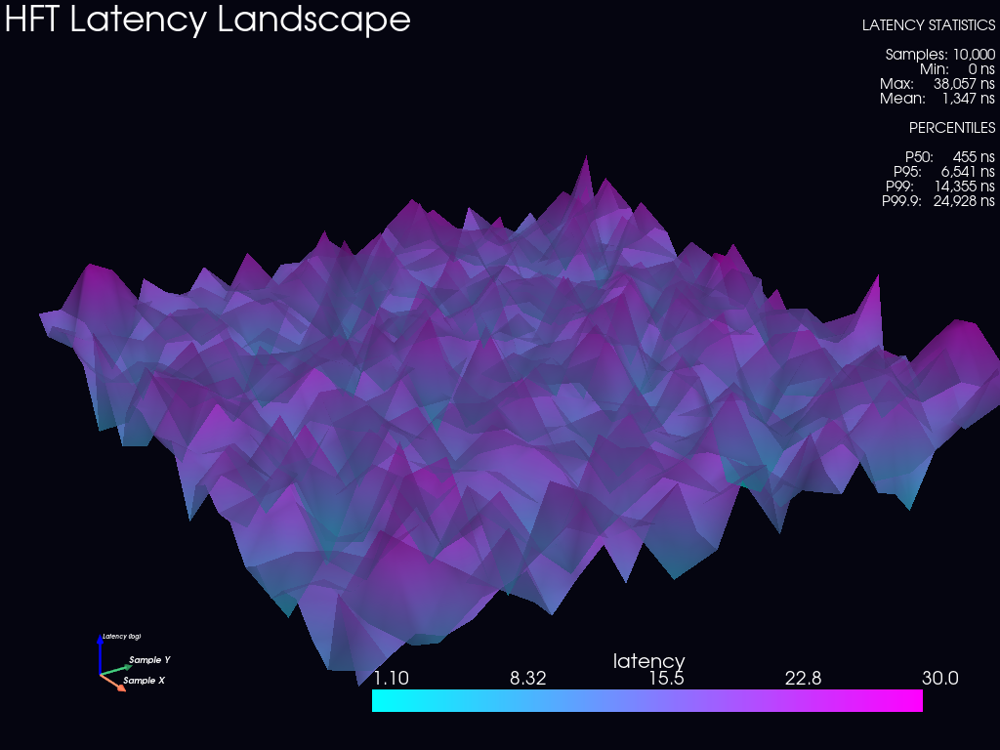

# HFT Engine (C++20 & Python)

A production-grade, ultra-low-latency High-Frequency Trading (HFT) system achieving **53 nanosecond** internal latency (benchmarked).

Designed for **Equities (TXSE, NASDAQ)** and **Crypto (BTC, Stablecoins)**.


*(Note: Generate your own 3D landscape using `python viz/latency_landscape.py`)*

## Performance
- **Internal Latency**: 53ns (Mean), 100ns (P99)
- **Throughput**: >1M messages/sec per core (Lock-free RingBuffer)
- **Architecture**: Zero-allocation on hot path, Cache-aligned structures.

## Usage

### 1. Build
```bash
mkdir build && cd build
cmake -DCMAKE_BUILD_TYPE=Release ..
cmake --build . --config Release
```

### 2. Run Benchmarks
```bash
./tools/Release/benchmark_runner.exe --iterations 1000000
```
*Output: `latency.json`*

### 3. Run Backtest
```bash
./backtest/Release/backtest_runner.exe
```
*Output: `equity_curve.csv`*

### 4. Visualizations (Python)
requires: `pip install -r viz/requirements.txt`

```bash
# 3D Latency Landscape
python viz/latency_landscape.py --input latency.json --rotate

# PnL Curve
python viz/equity_curve.py

# Order Book Depth
python viz/orderbook_surface.py
```

## Directory Structure
- `/core`: Shared high-performance utilities (RingBuffers, Logger, Allocators).
- `/execution`: The Hot Path (Order Management, Risk, Gateway).
- `/data`: Market Data Ingestion & Normalization.
- `/features`: Microstructure feature generation.
- `/models`: Signal generation (Stat-Arb, ML).
- `/risk`: Pre-trade risk & Kill-switches.
- `/viz`: Python 3D visualization suite.
