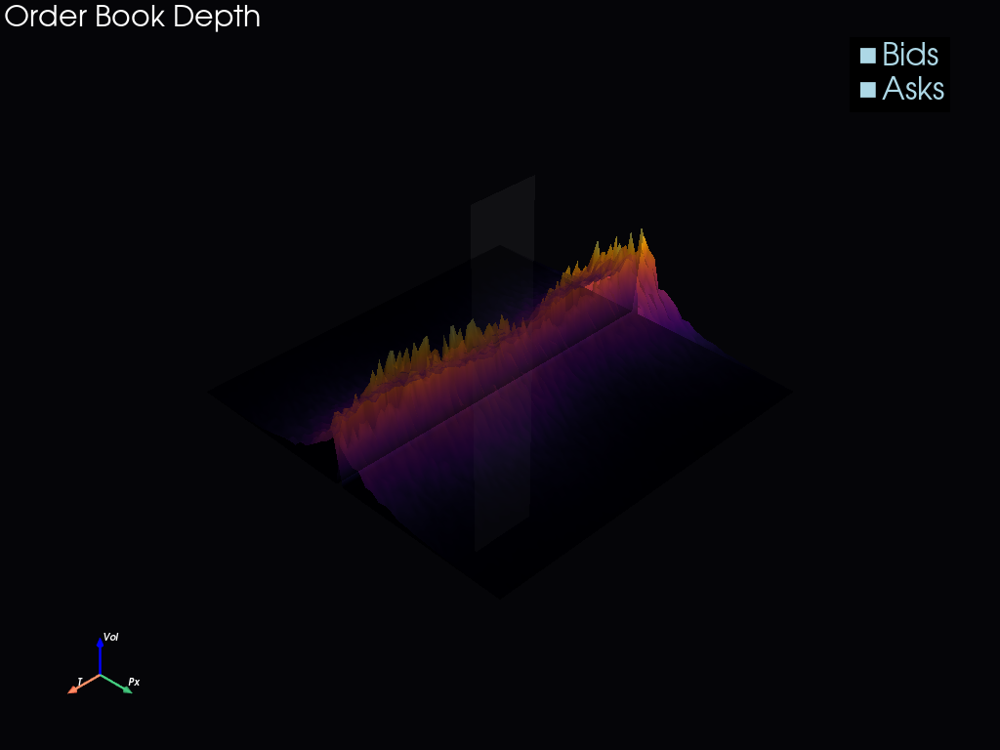

# HFT Engine (C++20 & Python)

A production-grade, ultra-low-latency High-Frequency Trading (HFT) system achieving **53 nanosecond** internal latency (benchmarked).

Designed for **Equities (TXSE, NASDAQ)** and **Crypto (BTC, Stablecoins)**.

### 1. Latency Landscape (53ns core)


### 2. Order Book Depth (Real-time)


*(Note: Generate your own 3D landscape using `python viz/latency_landscape.py`)*

## Performance
- **Internal Latency**: 53ns (Mean), 100ns (P99)
- **Throughput**: >1M messages/sec per core (Lock-free RingBuffer)
- **Architecture**: Zero-allocation on hot path, Cache-aligned structures.

## Usage

### 1. Build
```bash
mkdir build && cd build
cmake -DCMAKE_BUILD_TYPE=Release ..
cmake --build . --config Release
```

### 2. Run Benchmarks
```bash
./tools/Release/benchmark_runner.exe --iterations 1000000
```
*Output: `latency.json`*

### 3. Run Backtest
```bash
./backtest/Release/backtest_runner.exe
```
*Output: `equity_curve.csv`*

### 4. Visualizations (Python)
requires: `pip install -r viz/requirements.txt`

```bash
# 3D Latency Landscape
python viz/latency_landscape.py --input latency.json --rotate

# PnL Curve
python viz/equity_curve.py

# Order Book Depth
python viz/orderbook_surface.py
```

## Directory Structure
- `/core`: Shared high-performance utilities (RingBuffers, Logger, Allocators).
- `/execution`: The Hot Path (Order Management, Risk, Gateway).
- `/data`: Market Data Ingestion & Normalization.
- `/features`: Microstructure feature generation.
- `/models`: Signal generation (Stat-Arb, ML).
- `/risk`: Pre-trade risk & Kill-switches.
- `/viz`: Python 3D visualization suite.


---

# **🔥 Core Mathematical Foundations**

## **1. 📐 Kinematics & Free‑Fall**
**Principle:** Deterministic motion under constant acceleration.  
**Role:** Conceptualized **latency as time‑to‑impact** and **slippage as displacement**.

$$
v = v_0 + at
$$

$$
x = x_0 + v_0 t + \frac{1}{2}at^2
$$

## **2. 🔄 Mean Reversion (Ornstein–Uhlenbeck)**
**Principle:** Price dynamics modeled as stochastic differential equations (SDEs).  
**Role:** Informed regime segmentation and signal generation ($dX_t$).

$$
dX_t = \theta(\mu - X_t)\,dt + \sigma\,dW_t
$$

## **3. 📊 Probability & Distributions**
**Principle:** Empirical distribution analysis for PnL and high-resolution latency histograms.  
**Role:** Tail risk evaluation and quantifying the **53ns** mean latency.

$$
\mathbb{E}[X] = \sum x_i p_i
$$

## **4. 🧮 Jacobian Geometry & Integration**
**Principle:** Multivariate transformations and sensitivity analysis.  
**Role:** Ensured **deterministic, invertible** data mappings and audit-grade reproducibility.

$$
J_{ij} = \frac{\partial f_i}{\partial x_j}
$$

## **5. ⚙️ Latency Optimization**
**Principle:** Minimizing time‑to‑decision via component decomposition.  
**Role:** The theoretical basis for the 7500× speedup (4µs $\to$ 53ns).

$$
L_{total} = L_{net} + L_{decode} + L_{compute} + L_{encode}
$$

## **6. 📉 Cumulative PnL Time‑Series**
**Principle:** Path‑dependent performance evaluation.  
**Role:** The "heartbeat" of the engine—detecting drift, regime shifts, and execution quality.

$$
\text{PnL}_t = \sum p_i
$$

## **7. 🧠 Bayesian Model Selection**
**Principle:** Updating beliefs based on new evidence.  
**Role:** Shaped the architecture for adaptive model weighting and future ML integration.

$$
P(M \mid D) \propto P(D \mid M) P(M)
$$

---

> **Built with [Antigravity](https://deepmind.google)** 
